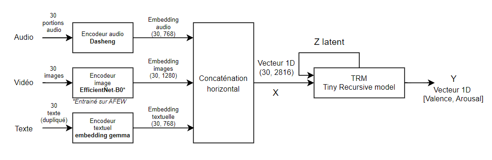
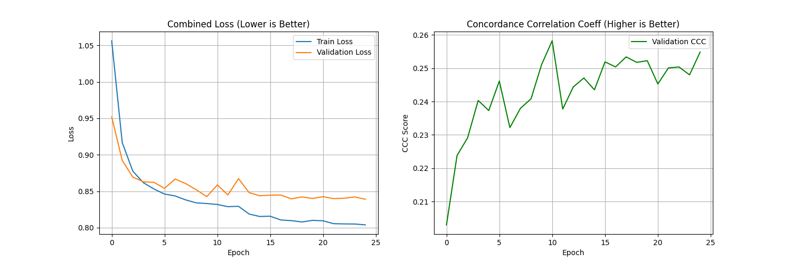
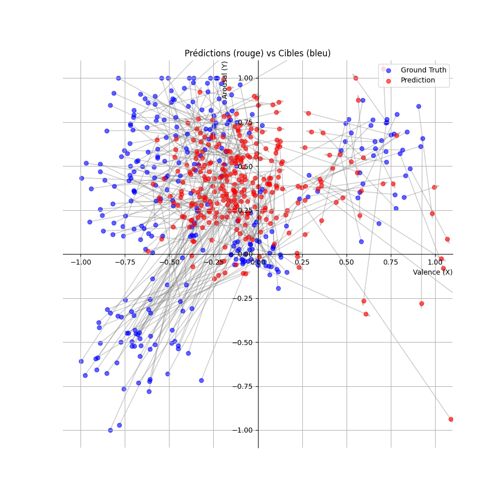

# Affective-TRM : Reconnaissance d'Émotion Multimodale Récursive

   

**Affective-TRM** est une architecture de Deep Learning conçue pour la reconnaissance d'émotions en continu (**Valence / Arousal**) à partir de flux vidéo temps réel.

Contrairement aux approches classiques qui classifient une émotion en catégories discrètes (ex: "Colère", "Joie"), ce modèle projette l'état émotionnel dans un **espace latent continu** en fusionnant trois modalités : **Audio, Vidéo et Texte**.

Le modèle est capable de tourner en temps réel avec une empreinte mémoire réduite grâce à son architecture récursive.

---

## 🧠 Architecture du Modèle

Le cœur du projet repose sur le **Tiny Recursive Reasoning Model (TRM)**. C'est une architecture hybride inspirée des travaux de Samsung SAIL, combinant la puissance des Transformers avec l'efficacité séquentielle des RNNs.

<p align="center">
  
</p>


*Architecture du Tiny Recursive Model (Source: Samsung SAIL)*

### 1. Entrée Multimodale Massive (2816 dims)
Le modèle ingère un vecteur concaténé représentant l'état complet de l'utilisateur à un instant $t$ :
*   **Audio (768 dims)** : Features extraites via **Dasheng** (Wav2Vec/Hubert optimisé).
*   **Vidéo (1280 dims)** : Features spatiales issues d'**EfficientNet-B0** pré-entraîné sur AFEW (via HSEmotion).
*   **Texte (768 dims)** : Embeddings sémantiques issus de **EmbeddingGemma** (Google).
*   *Fusion* : Les modalités sont concaténées horizontalement et normalisées (LayerNorm).

### 2. Le Flux de Données (Pipeline)


*   **Synchronisation** : Le système est cadencé sur la vidéo (30 FPS).
*   **Audio** : Alignement temporel par fenêtres glissantes synchronisées avec les frames.
*   **Texte** : Injection continue du contexte sémantique (dupliqué temporellement).
*   **Récurrence** : À chaque pas de temps, le TRM met à jour sa mémoire latente $Z$ en fonction de l'entrée $X_t$ et de son état précédent $Z_{t-1}$.

---

## 🔬 Méthodologie et Entraînement

Ce projet transforme un dataset de classification (CREMA-D) en problème de régression continue.

### 1. Mapping Discret $\rightarrow$ Continu
Les émotions discrètes sont projetées sur le modèle Circumplex de Russell via des centroïdes, avec ajout de **bruit gaussien** et modulation d'intensité pour simuler une distribution réelle :
*   **Colère** $\rightarrow$ Valence Négative / Arousal Haut
*   **Joie** $\rightarrow$ Valence Positive / Arousal Haut
*   **Tristesse** $\rightarrow$ Valence Négative / Arousal Bas
*   *Etc.*

### 2. Fonction de Perte (Loss) Hybride
Pour garantir à la fois la compréhension de la dynamique émotionnelle et la stabilité des prédictions, nous utilisons une Loss combinée :

$$Loss_{total} = Loss_{CCC} + 0.25 \times MSE_{real}$$

*   **$Loss_{CCC}$ ($1 - CCC$)** : Maximise la corrélation de forme. Force le modèle à comprendre les variations (montée/descente) de l'émotion.
*   **$MSE_{real}$ (Mean Squared Error)** : Agit comme une ancre pour empêcher les prédictions de dériver hors de l'espace $[-1, 1]$ et maintient l'échelle correcte.

---

## 📊 Résultats

Le modèle a été entraîné sur 25 époques avec une séparation stricte par locuteur (Speaker Independent).

| Métrique | Score Final (Ep 25) | Interprétation |
| :--- | :--- | :--- |
| **Train Loss** | 0.804 | Bonne convergence de l'apprentissage. |
| **Val Loss** | 0.839 | Pas d'overfitting majeur (courbe stable). |
| **Val CCC** | **0.255** | Corrélation positive significative sur des données synthétiques bruitées. |

### Visualisations
| Historique d'Apprentissage | Espace Valence/Arousal (Test) |
| :---: | :---: |
|  |  |
| *La dynamique du CCC (courbe verte) montre une amélioration constante jusqu'à la fin.* | *Le modèle (rouge) couvre correctement les quadrants haut définis par la vérité terrain (bleu), mais se retrouve en difficulté pour la partie en bas à droite.* |


## ⚠️ Limitations et Observations (Post-Mortem)

Bien que l'architecture technique (TRM + Fusion Multimodale) soit fonctionnelle sur CPU, des biais ont été observés lors de l'inférence en conditions réelles (Webcam) :

1.  **Biais "Bas-Gauche" (Low Arousal / Negative Valence)** :
    *   Le modèle tend à être conservateur et prédit majoritairement des états neutres ou légèrement négatifs.
    *   Il peine à atteindre le quadrant "Haut-Droit" (Joie/Excitation) sans une exagération volontaire de l'utilisateur.
    *   **Cause probable** : L'utilisation d'une **phrase neutre mise en cache** lors de l'inférence (pour économiser le CPU) prive le modèle de la modalité sémantique positive. De plus, le dataset d'entraînement (CREMA-D) est joué par des acteurs, créant un décalage (Domain Shift) avec des expressions naturelles devant une webcam.

## 🔮 Pistes d'Amélioration (Roadmap)

Ce projet est une preuve de concept (PoC). Pour passer à un système robuste en production, voici les axes prioritaires :

### 1. Données
*   Abandonner le mapping artificiel (Classification $\to$ Régression).
*   Utiliser des datasets annotés nativement en Valence/Arousal continu, tels que **RECOLA**, **SEWA** ou **MSP-IMPROV**. Cela permettrait au modèle d'apprendre de vraies nuances humaines plutôt que des centroïdes simulés.

### 2. Gestion du Texte (Alignement Temporel)
*   Actuellement : Le texte est dupliqué globalement sur toute la séquence.
*   Cible : Implémenter un **alignement mot-à-mot** (Word-Level Alignment). Le vecteur sémantique ne devrait changer que lorsque le mot est prononcé.
*   Intégration d'un ASR léger (ex: **Vosk** ou **Whisper-Tiny**) pour générer le texte en temps réel au lieu d'utiliser une phrase d'ancrage neutre.

### 3. Architecture
*   Remplacer la concaténation simple par un mécanisme de **Cross-Attention** (le texte "interroge" la vidéo) pour mieux pondérer l'importance de chaque modalité selon le contexte (ex: ignorer la vidéo s'il fait sombre, ignorer l'audio s'il y a du bruit).


---

## 🚀 Installation et Utilisation

### Pré-requis
*   Python 3.11+
*   PyTorch (CUDA recommandé)
*   `uv` ou `pip`

### 1. Téléchargement des Dépendances
Ce script télécharge automatiquement le dataset, les poids des encodeurs (Llama, Gemma, ENet) et les outils nécessaires.
```bash
python downloads.py
```

### 2. Préparation des Données
Extrait les features Audio/Vidéo/Texte et crée le dataset `.pt`.
```bash
python prepare_data.py
```

### 3. Entraînement (Optionnel)
Si vous souhaitez ré-entraîner le modèle depuis zéro :
```bash
python train.py
```

### 4. Inférence Temps Réel
Lance la webcam, enregistre l'audio et affiche l'émotion en direct.
```bash
python run_inference.py
```

---

## 📥 Modèle Pré-entraîné

Les poids du modèle entraîné (TRM) sont disponibles sur HuggingFace :
🤗 **[HuggingFace: JusteLeo/AffectiveTRM](https://huggingface.co/JusteLeo/AffectiveTRM)**

Téléchargez `emotion_model_sequential_av.pth` et placez-le à la racine du projet si vous ne voulez pas lancer l'entraînement.

---

## 📜 Crédits et Références

Ce projet n'aurait pas été possible sans les travaux de recherche et les modèles open-source suivants :

*   **Architecture TRM** : Basé sur *Tiny Recursive Models* (Samsung SAIL Montreal).
    *   [GitHub Repository](https://github.com/SamsungSAILMontreal/TinyRecursiveModels)
*   **Encodeur Audio** : *Dasheng* (DCASE 2023 Winner).
    *   [GitHub Repository](https://github.com/RicherMans/Dasheng)
*   **Encodeur Vidéo** : *HSEmotion* (EfficientNet-B0 sur AFEW).
    *   [GitHub Repository](https://github.com/av-savchenko/hsemotion)
*   **Encodeur Texte** : *EmbeddingGemma* (Google).
    *   [HuggingFace Model](https://huggingface.co/google/embeddinggemma-300m)
*   **Dataset** : *CREMA-D* (Crowd-sourced Emotional Multimodal Actors Dataset).
    *   [GitHub Repository](https://github.com/CheyneyComputerScience/CREMA-D)
---

*Projet réalisé dans le cadre d'un Master 1 Électronique / IA.*